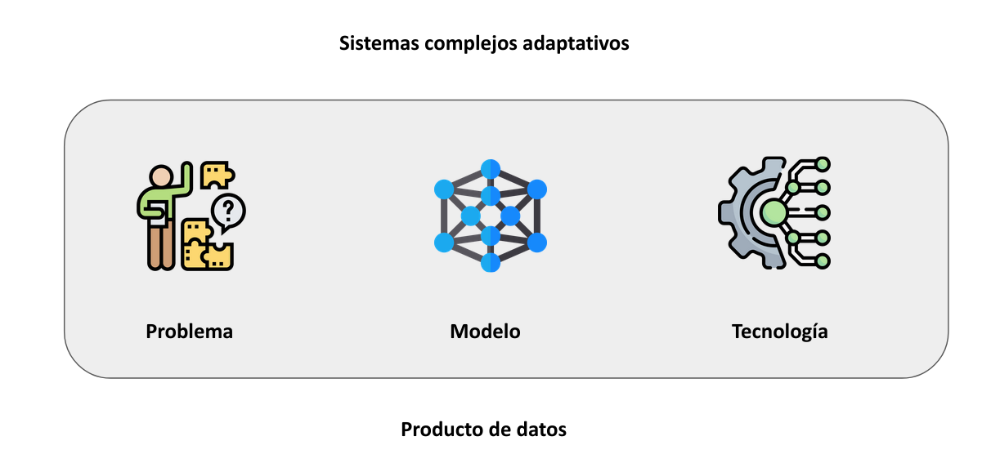

Diciembre 2021

M. Sc. Liliana Millán Núñez liliana.millan@tec.mx

## Ciencia de datos como herramienta para el rastreo, tratamiento y análisis de información

### Contenido

+ Introducción
  + Ciencia de datos
  + Características
  + Qué se puede hacer con ciencia de datos
  + Qué no es ciencia de datos

***

### Ciencia de datos

+ Matemáticas y estadística
+ Ciencia computacionales
+ Donimio del conocimiento del negocio/problema

Modelos:

* *Machine Learning*
* Redes bayesianas
* Grafos
* Modelos Gráficos Probabilísticos
  + Redes Bayesianas
  + Redes Markovianas

#### Características de soluciones de Ciencia de datos

* Modelos adaptativos → "vivos"
* Predicciones a nivel individual
* El modelo se ajusta a la realidad del problema
* Solución hecha a la medida (empresa/organización ↔ contexto)
* Predicción orientada a una meta → meta orientada a una acción

→ Brindar más información -generado de la evidencia en los datos- al tomador de decisiones para que este pueda tomar la mejor decisión en el contexto del problema.

#### ¿Qué se puede hacer con Ciencia de Datos?

1. Predicción

* Con datos del pasado generar un modelo que aprenda patrones que nos puedan ayudar a encontrar el valor futuro de alguna variable/comportamiento.

Por ejemplo:

"Dado el comportamiento financiero de la empresa X, se le considera atípica" → El modelo desarrollado predice si una empresa es atípica o no dado su comportamiento financiero.

2. Agrupaciones/asociaciones

* Agrupaciones: Con los datos del pasado generar un modelo que nos permita identificar qué caracteristicas hacen que las entidades se parezcan unas con otras.

Por ejemplo:

"De todas las empresas listadas en la BMV existen 10 grupos diferentes, el grupo 1 con las características: A, B, C, D, E, F" → Las características son multidimensionales y pueden incluir dimensiones obtenidas a través de análisis de texto además de variables numéricas y categóricas.

* Asociaciones: Con los datos del pasado generar un modelo que nos permita conocer qué cosas suceden juntas, es decir, en presencia de uno también se presenta el otro(s).

Por ejemplo:

"Cada vez que una empresa omite el valor de la variable X en su estado financiero también omite el valor Y en otro informe."

3. Optimización

Con los datos históricos identificar cuál es la mejor estrategia a seguir de acuerdo a la "situación". Se requiere de tener recompensa, castigo, meta y estados bien definidos.

Por ejemplo:

4. Causalidad

Identificar qué variables afectan a otras en un problema de interés bajo el conexto en el que el problema sucede.

Por ejemplo:

#### ¿Qué no puede hacer Ciencia de datos?

* Suplir una buena cultura de datos organizacional
* Suplir a un humano
* Econometría
* Un mismo modelo no puede contestar más de 1 pregunta a la vez
* Un mismo modelo no se puede implementar *as is* en otro contexto **aunque sea el mismo problema**

#### ¿Qué no es Ciencia de datos?

* *Dashboards* → *Business Intelligence*
* Reportes → *Business Intelligence*
* Automatización de procesos → TI
* Econometría → Definición de valores específicos en variables que modifican el contexto en el que sucede el problema. \* Ejemplo: *Long term unemployed*
* No es (sólo) tecnología → TI
* No son (sólo) algoritmos → *Machine learning*
* Reemplazo de personas

