Diciembre 2021

M. Sc. Liliana Millán Núñez liliana.millan@tec.mx

## Datos

### Contenido

+ Tipos de datos
+ Datos numéricos
  + Métricas de centralidad
  + Métricas de dispersión
  + Datos faltantes
    + Imputación de datos
+ Visualización
***

### Tipos de datos

#### Datos tabulares - transaccionales

Dato en formato de tabla en donde cada renglón o fila es una observación/evento/transacción y cada columna es una característica de esa observación.

 
Fuente: [R for Data Science](https://r4ds.had.co.nz/tidy-data.html)

Por ejemplo:

|id|RFC|Razón social|Número de empleados|Tamaño|Antigüedad|Tipo|
|:-----|:---------|:--------|:---------|:---------|:--------|:--------|
|231|ADA110907XYZ|Una empresa S.A de C.V|15|pequeña|21|privada|
|5321|ABC110907XYZ|X empresa|46|pequeña|5|privada|
|3158|CBA110907XYZ|La empresa|67|mediana|7|privada|

#### Datos no transaccionales

Los datos no se encuentran en un formato tabular por lo que cada renglón o fila no es una observación/transacción/evento.

#### Geoespaciales

Datos que representan una ubicación geográfica en la tierra. Pueden estar en diferentes formatos de proyección, el formato más común es un par de coordenadas con latitud y longitud.

#### Sonido

Es posible descomponer el sonido en variables que podemos incluir en un análisis de datos. Por ejemplo: Frecuencia de la onda, amplitud, *Zero Crossing rate* → contar el número de veces que la onda de sonido cambia de positivo a negativo.

#### Imágenes

Al igual que con el sonido, es posible descomponer una imagen en variables que conservan las características e información de la imagen a través de las cuáles podemos realizar un análisis e integrar estas variables a modelos predictivos. Por ejemplo: descomposición de un pixel en saturación en verde, azúl y rojo, saturación del pixel, etc.

#### Video

Para analizar video primero se descompone en *frames* haciendo de cada *frame* una imagen que en secuencia almacena la información del video.

#### Texto

También es posible analizar texto al aplicar minería de texto, específica para el lenguaje en el que se encuentra el texto. Las técnicas de minería de texto obtienen variables que podemos integrar a los análisis de datos y modelos predictivos.

### Otra clasificación

+ Numéricos
  + Enteros: `1`, `-5`, `10`
  + Flotantes: `3.2455`, `1.00`, `-521.987`
+ Binarios (*Boolean*): `0` -False-, `1` -True-
+ Fechas:
  + Date `2021-12-08`
  + Timestamp `2021-12-08 23:05:45`
  + Time: `11:34:12`
+ Categóricos: `Alto`, `Bajo`, `Normal`; `Mujer`, `Hombre`; `Atípico`, `Normal`

## Repaso

### Métricas de centralidad

Estas métricas nos permiten conocer qué tan dispersos -varianza- están los datos con los que contamos por cada variable.

+ **Media o promedio**: Se utiliza en variables numéricas para dar una idea de qué valor es el central en tu conjunto de datos. Se obtiene al sumar el valor de una característica o variable específica y dividir entre el número total de observaciones.

OJO, esta métricas es susceptible a valores atípicos por lo que se sugiere utilizar con precaución.

Por ejemplo: Tenemos los siguientes datos:

|id|salario|
|:------|:-------|
|1|3,500|
|2|4,000|
|3|1,500|
|4|25,000|
|5|3,500|

Las observaciones de este conjunto de datos ganan en promedio un salario de $7,500 ... pero este número es "engañoso" porque hay un registro atípico de una persona que tiene un salario mucho mayor al resto.

+ **Mediana**: Esta métrica nos permite identificar qué valor es el que balancea a los datos, el que está al 50%. La interpretación de este valor corresponde a saber que el 50% de nuestros datos tiene un valor menor o igual al valor que tenga la mediana.

Por ejemplo, de los salarios del ejemplo de la media, la mediana toma el valor de $3,500.

+ **Moda**: Esta métrica nos permite conocer cuál es el valor que más ocurre. Se puede ocupar tanto en variables

¿Cuál ocupar? Depende de la pregunta que quieres contestar, lo único que es seguro es que si ocupas el promedio debes acompañarla siempre de la desviación estándar para identificar si el valor asociado ha sido susceptible a valores atípicos.

### Métricas de dispersión

+ **Desviación estándar**: Pertime identificar qué tan dispersos están tus datos. Mientras más grande sea el número indica que hay más dispersión en tus datos → están más separados entre sí.

Por ejemplo, de los datos de salarios, la desviación estándar es de $9,829.802, esto significa que el promedio puede variar desde

###  Diagramas más utilizados

+ **Histogramas**: Te permiten conocer la distribución que siguen tus datos. De forma visual ayudan a conocer los valores en los que la mayoría de las observaciones se concentran.

Por ejemplo:

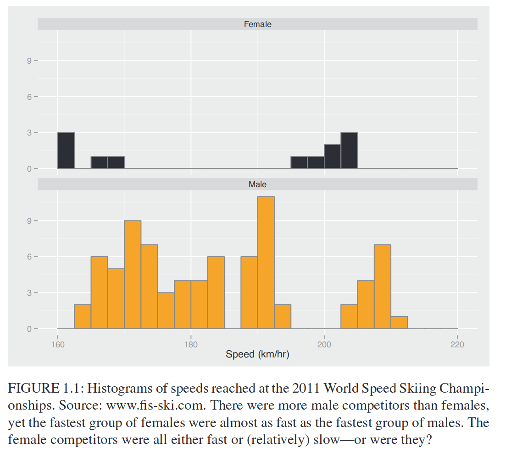
 
Fuente: [Graphical Data Analysis with R](https://www.crcpress.com/downloads/K25332/Chapter_1.pdf)

+ **Diagrama de caja y brazos**: Este diagrama se utiliza principalmente par identificar datos que son atípicos y además la distribución en cuartiles. En una misma gráfica se pueden identificar valores atípicos, el valor mínimo, máximo, primer cuartil (25%), segundo cuartil o mediana (50%) y tercer cuartil (75%).

Por ejemplo:

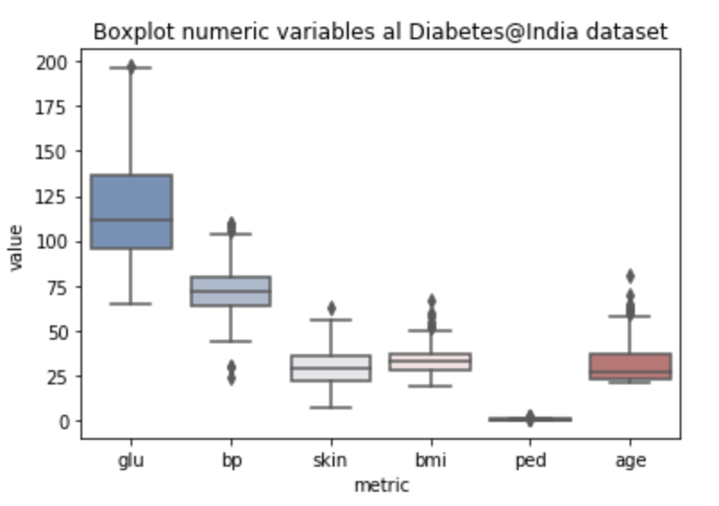
 

Para evitar malos entendidos, también es útil agregar el promedio a la gráfica -triángulo rojo-.

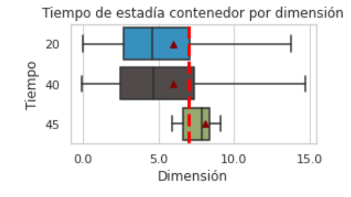
 

+ **Diagrama de barras**: Esta gráfica se utiliza tanto para mostrar porcentajes como para frecuencias. Se presentan ordenando de mayor a menor frecuencia, ya sea horizontal o verticalmente.

![]

+ **Scatterplots**: Esta gráfica te permite visualizar la relación entre dos variables numéricas.

Por ejemplo:

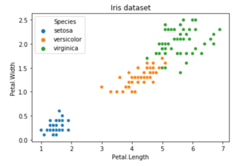

### Reglas básicas de visualización

1. Mientras más sencilla mejor → queremos evitar ambigüedades en la interpretación de la gráfica
* No generes gráficas con más de 4 variables al mismo tiempo: ejes, color, tamaño.

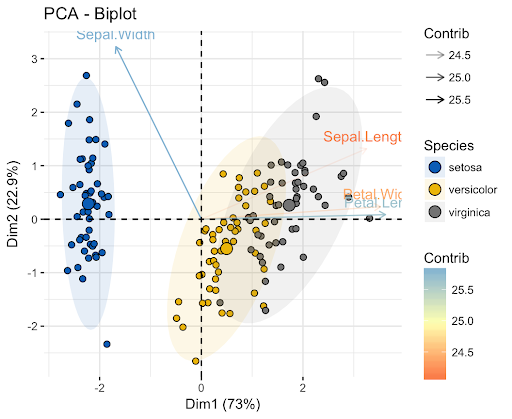
 
Fuente: [STHDA](https://www.google.com/url?sa=i&url=http%3A%2F%2Fwww.sthda.com%2Fenglish%2Farticles%2F31-principal-component-methods-in-r-practical-guide%2F112-pca-principal-component-analysis-essentials%2F&psig=AOvVaw1oZCrJJATp4_sPEQcVukRj&ust=1638941586075000&source=images&cd=vfe&ved=0CAsQjRxqFwoTCPiFw7D70PQCFQAAAAAdAAAAABAF)

2. Siempre agregar títulos a cada eje incluyendo sus unidades en caso de necesitarlo. Por ejemplo, si el eje es dinero indica si es MXN, dólares, etc.

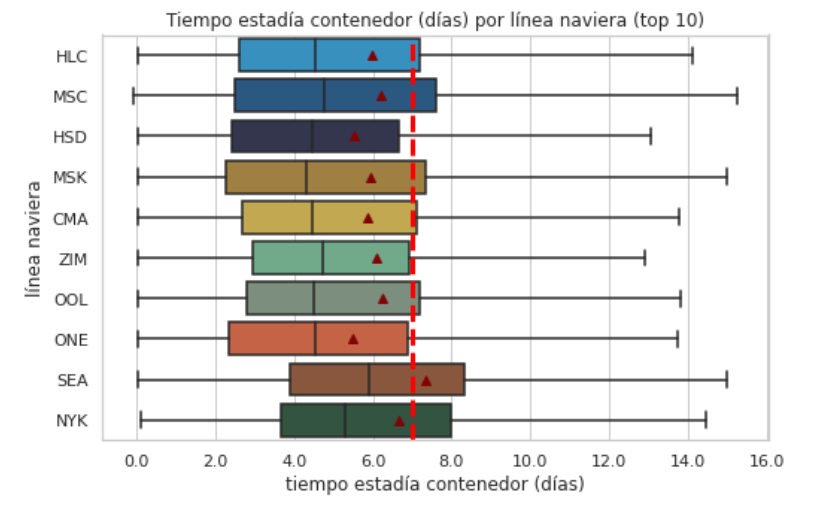

3. Si las etiquetas de algún eje ocupan cifras de más de 3 dígitos agrega siempre comas! o abrevia la cifra. Por ejemplo: 3.5k en lugar de 3,500.

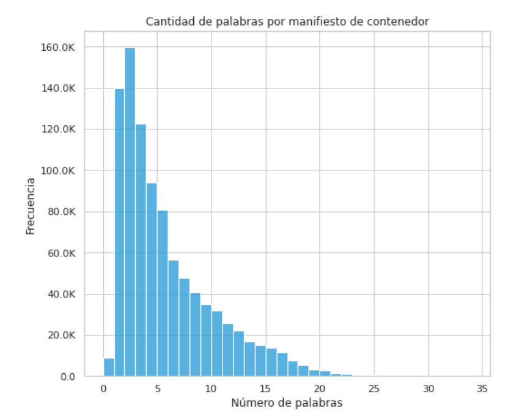

4. **NUNCA** utilices gráficas de *pie*, en su lugar utiliza gráficas de barras horizontales ordenadas de mayor a menor porcentaje.

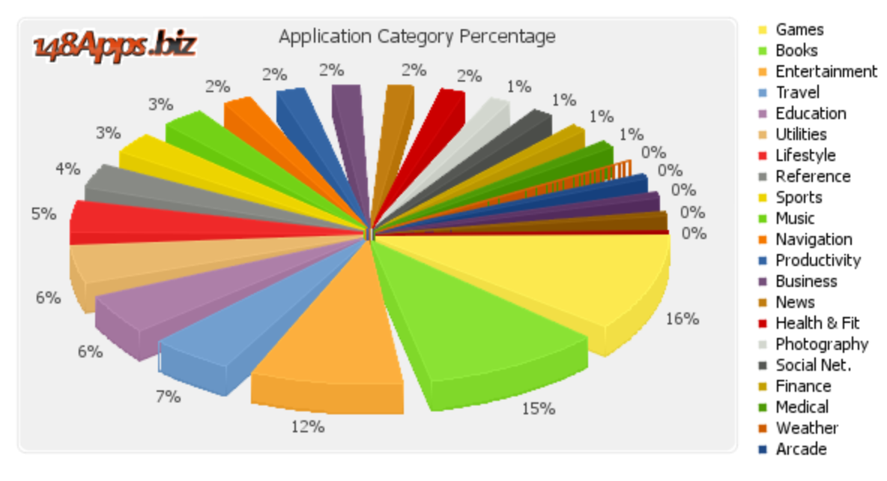
 
Fuente: [Peltier Tech Blogs](https://peltiertech.com/extra-distortion-in-a-pie-chart/)

En lugar de presentar así:
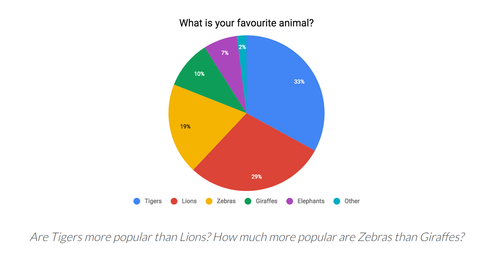

Presentar así:
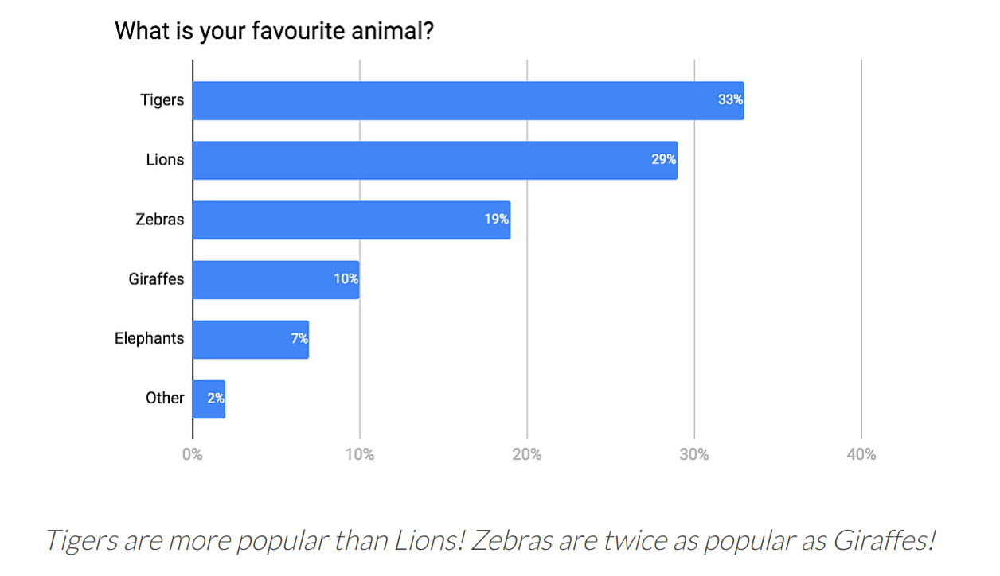

5. Si uno de tus ejes incluye meses del año, días de la semana, horas del día, etc.; respeta el orden cronológico en el que existen.
* Meses del año: enero, febrero, marzo, abril, mayo, ..., diciembre
* Días de la semana: lunes, martes, miércoles, ..., domingo
* Horas del día: 0, 1, 2, 3, ..., 23

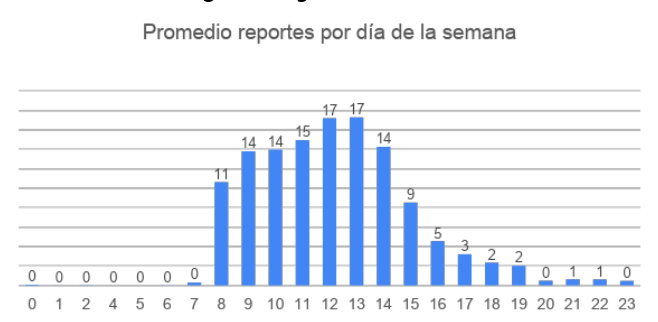
 

6. En variables numéricas utiliza un mismo color de mayor a menor saturación.

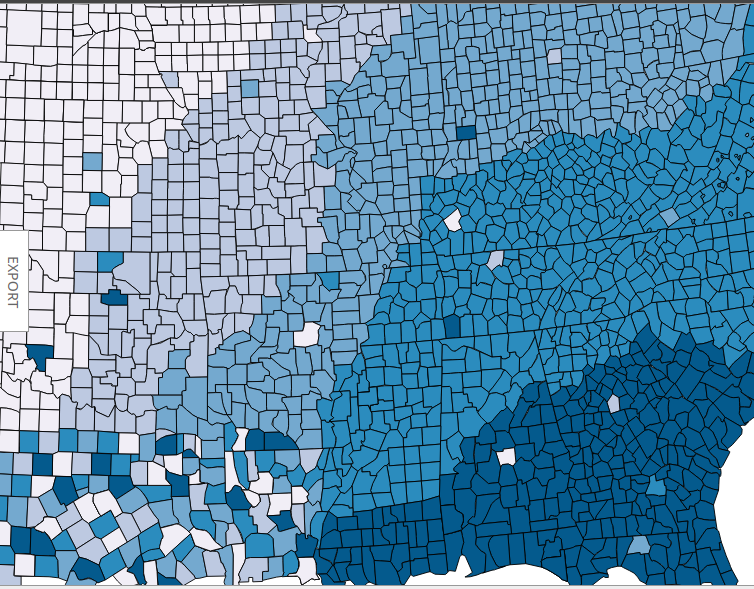

7. En variables categóricas utiliza colores diferentes para categoría **únicamente** si pondrás una leyenda con el valor que toma cada color, en caso contrario solo ocupa un color entre las diferentes categorías.

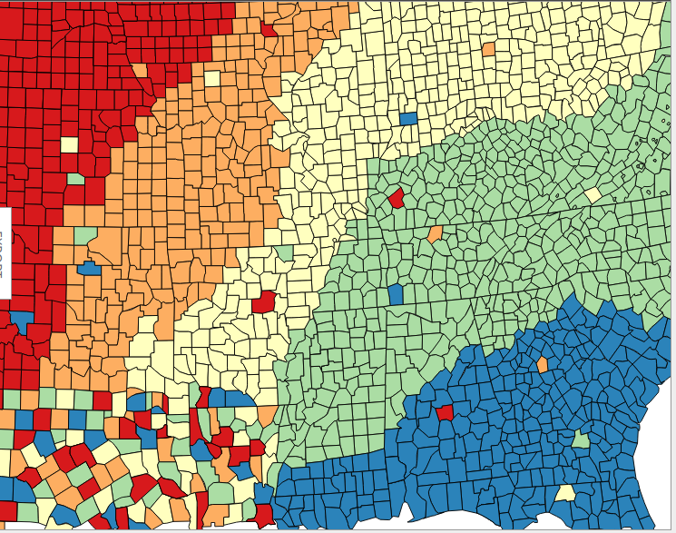

La siguiente página te puede servir de guía para visualizaciones [Data to viz](https://www.data-to-viz.com/), no dejes de leer la parte de *caveats*.

[Inicio](./index.md)
